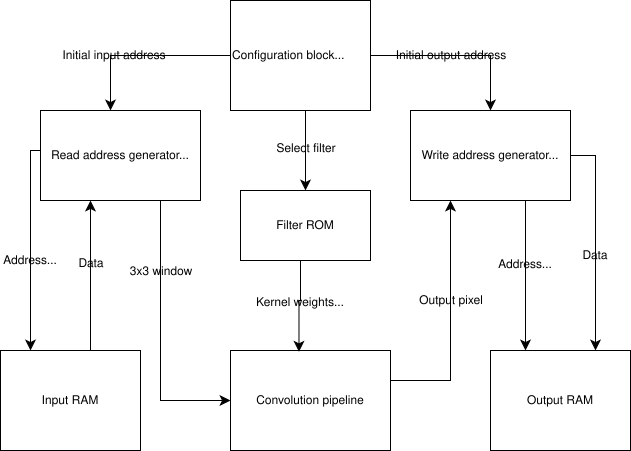

# ZCH Project - 3x3 Convolution Filter

## Overview
- The design reads a 64x64 pixel grayscale image from a provided address in input RAM, applies a 3x3 convolution filter, and writes the processed 62x62 
  image to specified address in output RAM.
- The user can use configuration registers to choose between 4 provided filters, stored in ROM. 

## Block schema

https://github.com/hucovic-vladimir/ZCH-projekt/blob/main/ZCH.svg

## I/O specification

### Inputs
- CLOCK
- RESET - Resets all internal signals and configuration registers to default values, stops computation
- CFG_WRITE_EN - Enables write to configuration registers (modify filter selection, starting input/output address).
- FILTER_SELECTION_IN [1:0] - 2 bit signal to select the applied filter:
    - 00 => Sharpening
    - 01 => Gaussian smoothing
    - 10 => Vertical edge detection
    - 11 => Horizontal edge detection
- IN_ADDR [15:0] - Address of the first pixel of the input image (in input RAM).
- OUT_ADDR [15:0] - Address where the first byte of the output will be written (in output RAM).
- ENABLE - On rising edge, start the computation.
- Input image expected on IN_ADDR in input RAM.

### Outputs
- BUSY - 1 if convolution currently in progress, 0 if ready to start
- OUTPUT_READY - 1 after entire image processed and written to memory 
- ERROR - Set to 1 on error, e.g. input/output address too high or ENABLE set to high when BUSY = 1
- Processed image written to output memory at user-specified address

## Block description

### Configuration block
- Stores user configuration (selected filter, I/O addresses)

### Filter ROM  
- Stores kernel weights / scaling factor of filters
- Provides them to convolution pipeline when computation starts

### Input RAM 
- Contains input image

### Read address generator + line buffers 
- Translates row and column numbers into memory address
- Buffer stores 3 lines of input image at a time
- Constructs sliding 3×3 windows and passes them to convolution pipeline 

### Convolution pipeline  
- Handles convolution
    - Multiply using 9 multipliers
    - Accumulate with adder tree
    - Apply scaling
    - Clamp to <0, 255>

### Write address generator + output buffer 
- Stores result from convolution pipeline, computes the address and writes to output memory 

### Output RAM
- Contains the final 62×62 filtered image

### FSM (not in diagram, connected to everything except memory)
- Sends/receives internal control signals, keeps state of computation.

## Test cases

### 4 Functional test cases (1 per filter type)
    - Tests: Correct convolution result and normal control-signal behavior for each filter
    - Inputs
        - Random IN and OUT addresses (not out of range)
        - Set of different generated images (checkerboard, random noise, vertical/horizontal gradients, ...)
    - Expected output
        - ERROR low,
        - BUSY high during computation,
        - OUTPUT_READY high for 1 clock cycle after computation finishes, then cleared
        - Expected image (obtained with Python script) written to correct address
